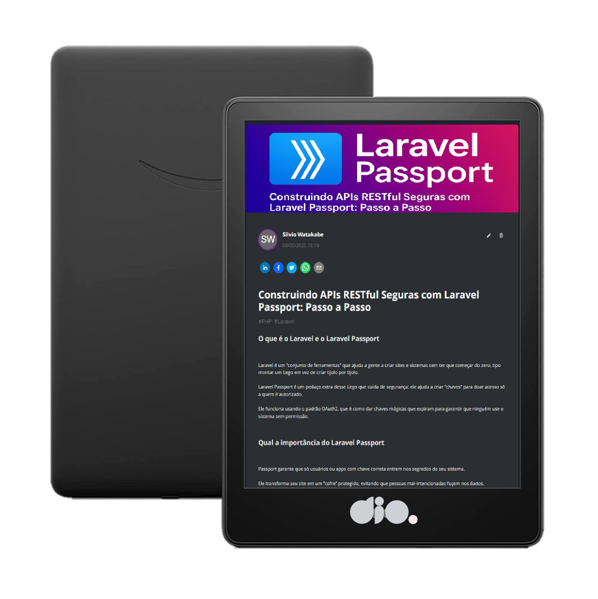

<p align="center">
    
</p>


<p align="center">
  <a href="https://dio.me/">
  </a>
  <a href="https://www.gnu.org/software/bash/" title="Go to Bash homepage">
  </a>
</p>

-------


# Projeto para gerar artigo técnico por meio de I.A.s


 > ℹ️ **NOTE:** Este é o repositório desenvolvido durante o curso Formação ChatGPT for Devs da  [DIO](https://web.dio.me/track/decf433b-9bc9-4ddc-bfd4-639ed8da82d9).

Projeto com o objetivo de gerar um artigo técnico com um layout rico, leitura agradável e com foco em promover sua autoridade técnica.

<p align="center">
  
</p>


<a href="https://web.dio.me/articles/construindo-apis-restful-seguras-com-laravel-passport-passo-a-passo-2deeccadb484?back=/articles" title="View PDF now"> 📕Clique aqui para ler o artigo</a>

## 💻 Tecnologias utilizadas no projeto

- [ChatGPT](https://chat.openai.com/) - para título e conteúdo
- [Lexica.art](https://lexica.art/) - para gerar imagens
- [PowerPoint](https://www.microsoft.com/en/microsoft-365/powerpoint) - Para formatação de banners e Layouts

## 📄 Prompts e ferramentas


ChatGPT：

|   Ação   | prompt                                                                                                                                                                                                                                                                         |
| :------: | ------------------------------------------------------------------------------------------------------------------------------------------------------------------------------------------------------------------------------------------------------------------------------ |
|  título  | Crie 10 headlines para nomes de artigos sobre Laravel Passport                                                                                                                                                                                                    |
| conteúdo | Conforme prompt abaixo | 
```
Comporte-se como um escritor de artigos tech Back-end e escreva o Artigo atendendo as regras:

<Regras>
> No máximo 5 linhas por bloco de explicação
> Me explique de maneira informal, como se eu fosse uma criança de 10 anos
> Os Blocos que serão criados estão abaixo
- O que é o Laravel e o Laravel Passport
- Qual a importância do Laravel Passport
- Cite exemplos de implementação do Laravel Passport
- Faça um call to action para as minhas redes sociais
- Insira 3 hashtags que façam sentidoo 
```


Lexica.art：

- No léxica utilizamos o acervo público de imagens geradas por outras pessoas, os termos de pesquisa que utilizei durante a gravação do conteúdo foram:

• Laravel Passport


## ✨ Features

- Conteúdo gerado via ChatGPT
- Imagens do acervo público geradas via Lexica.art

## 📚 Materiais

- prompts, imagens, texto revisado

## 🛠️ Instruções de execução

Utilize os prompts acima nas ferramentas sugeridas para gerar o material base e utilize uma ferramenta de edição de documentos como power point, libreoffice , indesign para diagramação.


---

por [Silvio](https://github.com/silvio-swat)
